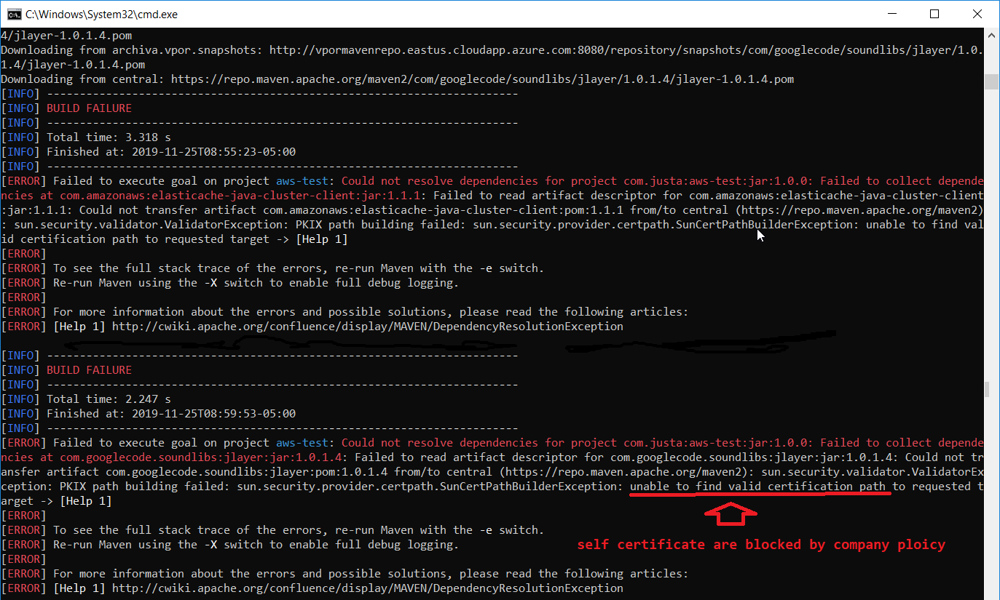

# EveryThing about maven

## tips
+ Your company may block maven central repo because the SSL certificate is almost expired :
    sun.security.validator.ValidatorException: 
	PKIX path building failed: 
	sun.security.provider.certpath.SunCertPathBuilderException: 
	unable to find valid certification path to requested target
    	
+ You can temporarily use HTTP to avoid this issue:	
https://stackoverflow.com/questions/25911623/problems-using-maven-and-ssl-behind-proxy
+ When you have to copy artifact from another computer, we have to delete this file :
    _remote.repositories
	otherwise it will complain: Could not find artifact even it is there	
+ Test scope  is not transitive, it means the child project still need to declare them in dependency if they have the same jars for unit test
+ Maven can’t automatically add system dependency, so better not to use it
+ We can use maven install plugin for native libs in a project, then our main project depend on it to solve local lib issue
	

	