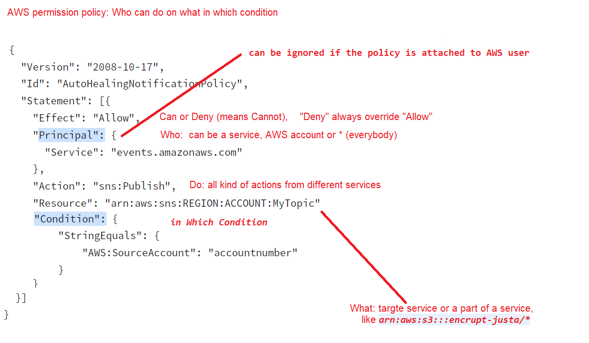
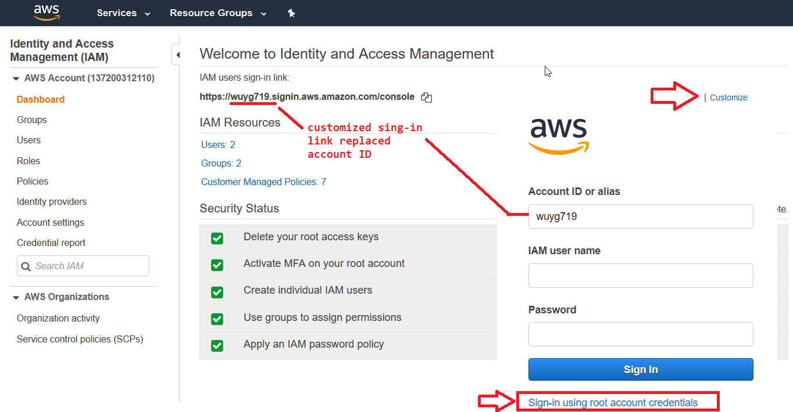
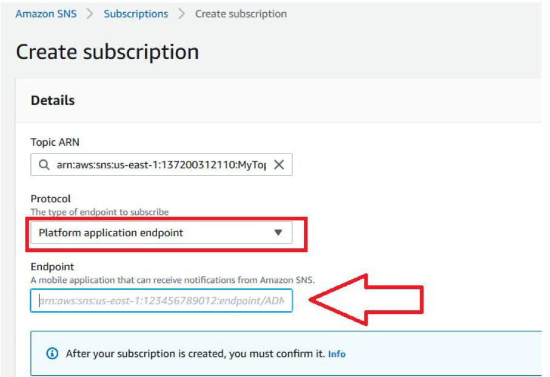
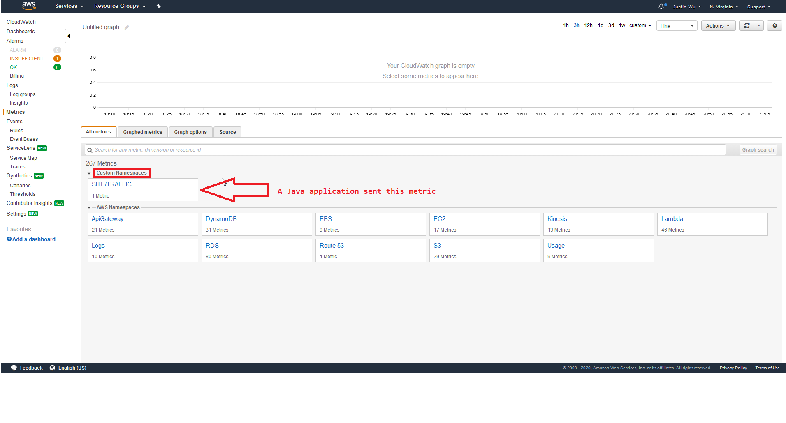
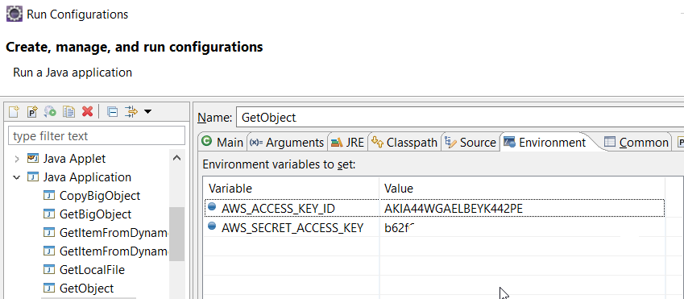

# AWS Learning

## S3
- An S3 object ACL is the only way to manage access to objects which are not owned by the bucket owner. 
  An AWS account that owns the bucket can grant another AWS account permission to upload objects.
- Amazon S3 offers access policy options broadly categorized as resource-based policies and user policies. 
   Access policies, such as ACL and resource policy can be attached to the bucket. 
   With the object the user can only have ACL and not an object policy. 
- The user can also attach access policies to the IAM users in the account. These are called user policies.  

### Bucket name dot issue  
WildCast SSL certificate can only support one level sub-domain: 
    [Wildcard_certificate](https://en.wikipedia.org/wiki/Wildcard_certificate) 

like *.google.com support www.google.com , but api. www.google.com will fail.
So when you create a bucket with a dot in it, it will fail because dot will let browse think it has
two level sub domain : 
```xml
  https://bucket.name.s3.amazon.com/key  
```

So in this case, you can move bucket into the key name: 
```xml
  https://s3.amazon.com/bucket.name/key
```

The second style is called path-style URL, first one is called virtual hosted-style URL
Usually AWS SDK and console can automatically handle this issue. But you need to switch the
UTL style if you directly access URL.

### Region
Us-east (N. Virginia) is the default S3 region, it doesn’t need region name is the URL: 
```xml
  https://s3.amazonaws.com/justa.ca/Ec2WinJoinAD.png
```
Other regions need region in the URL:
```xml
  https://s3-ap-southeast-1.amazonaws.com/justa.cn/CF_nested.png
```

### Copy
In the Copy operation, you set the same object as the source and target. In this way, you can
- Change existing object metadata
- Move objects across Amazon S3 locations
- Rename objects by copying them and then deleting the original ones
If you choose to update any of the object’s user-configurable metadata:
- system- 
- or user-defined
during the copy, then you must explicitly specify all of the user-configurable
metadata present on the source object in your request, even if you are changing only one of the metadata values.

## EC2
- After the user has assigned a secondary private IP address to his instance, he needs to configure the operating system on that instance to recognize the secondary private IP address. 
  For AWS Linux, the ec2-net-utils package can take care of this step.
- When a user creates an EBS volume and attaches it as a device, it is required to mount the device.
- If an EBS volume is attached to a running EC2 instance, the user needs to detach the volume from the original instance and then attach it to a new running instance. 
  The user doesn't need to stop / terminate the original instance.
  
### Init log
You can use AWS console system log menu on EC2 instance to see userData logs, but it will be
truncated if it is too long, so you can directly ssh to instance and check this file: `/var/log/cloud-init-output.log` 


### EBS
- EBS volumes are created in a specific Availability Zone, and can then be attached to any instances in that same Availability Zone.
- Amazon EBS volumes are designed to be highly available and reliable. 
  At no additional charge to you, Amazon EBS volume data is replicated across multiple servers in an Availability Zone to prevent the loss of data from the failure of any single component. 
- If a user has launched an EBS backed instance, the user will be charged for the EBS volume even though the instance is in a stopped state. 
  The instance will be charged for the EC2 hourly cost only when it is running.  
- The EBS snapshots are a point in time backup of the EBS volume. It is an incremental snapshot, is always specific to the region and never specific to a single AZ  
- When creating an EBS the user cannot specify the subnet or VPC. However, the user must create the EBS in the same AZ as the instance so that it can attach the EBS volume to the running instance.
- When a user is trying to mount a blank EBS volume, it is required that the user first creates a file system within the volume.
- The user can increase the size of the volume but cannot decrease it less than the original snapshot size.

### EFS
The service is highly scalable, highly available, and highly durable. Amazon EFS stores
data and metadata across **multiple Availability Zones** in a region, and it can grow to
petabyte scale, drive high levels of throughput, and allow massively parallel access from
Amazon EC2 instances to your data.

EFS restrictions:
-  You can mount an Amazon EFS file system on instances in only one VPC at a time.
-  Both the file system and VPC must be in the same AWS Region.

You can mount your Amazon EFS file systems on your on-premises servers when connected to
your Amazon VPC with AWS Direct Connect (DX)
AWS VPN is not supported for accessing an Amazon EFS file system from an on-premises server.

### Reserved Instance
A Reserved Instance on AWS is a billing concept and does not apply to a specific Amazon EC2 instance.
Each hour, the AWS billing system looks at all EC2 instances that have been running in a
particular AWS account. It then compares them with any Reserved Instances that have been
purchased. It compares the following attributes:
- Instance Type (eg m3.large)
- Operating System (eg Windows)
- Availability Zone (eg us-west-2)

For each EC2 instance that matches a Reserved Instance, no cost applies. This is because the
cost has already been paid as part of the Reserved Instance purchase.
The Reserved Instance applies regardless of whether the instance was launched through Auto Scaling.

Therefore, if you have purchased one Reserved Instance and your Auto Scaling group launches
instances that match the Reserved Instance (Type, OS, AZ), then one of the instances in your
Auto Scaling group will be "free" (or rather, pre-paid) each hour.
If your Auto Scaling group has a minimum of 1 and a maximum of 4, then there will always be at
least one EC2 instance running, so you would receive the benefit of the Reserved Instance. Any
instances above 1 will be charged normally. It is recommended that you use Reserved
Instances for any instance that will be running continuously.
From [here](https://stackoverflow.com/questions/30873849/use-reserved-instance-and-autoscaling-group)

## Security
- The IAM users by default cannot change their password. 
  The root owner or IAM administrator needs to set the policy in the password policy page, which should allow the user to change their password.
- The statement is the main element of the IAM policy and it is a must for a policy. 
- The root user can customize login url 
- The account alias must be unique across all Amazon Web Services products.
- It is a recommended rule that the root user should grant the least privileges to the IAM user or the group. 
  The higher the privileges, the more problems it can create.
- The only recommended use case for the bucket ACL is to grant write permission to the Amazon S3 Log Delivery group to write access log objects to your bucket.
   Please see [here](https://docs.aws.amazon.com/AmazonS3/latest/dev/access-policy-alternatives-guidelines.html)
- IAM is a free service. You can create as many IAM users or groups as desired free of cost.   

### Identity federating
IAM can integrate with two different types of outside Identity Providers (IdP):
- OpenId for federating web identities, like FaceBook...
- SAML for federating internal identities, Like Active Directory or LDAP
   
### Role
You don't need to set AWS_ACCESS_KEY_ID and AWS_SECRET_ACCESS_KEY in EC2
because they usually use role to get permissionI
You can use this CLI command (automatically installed)to verify your role in targte EC2:

`aws sts get-caller-identity`

```json
	{
		"Account": "137200312110",
		"UserId": "AROAR74OGT4XJA24NUIYS:i-0e387fb768f0e719d",
		"Arn": 	"arn:aws:sts::137200312110:assumed-role/WebServerRole/i-0e387fb768f0e719d"
	}
```
Here ec2 is assigned a role "WebServerRole"

### Policy evaluation
With regard to IAM, when a request is made, the AWS service decides whether a given request should be allowed or denied. 
The evaluation logic follows these rules:
- By default, all requests are denied. (In general, requests made using the account credentials for resources in the account are always allowed.)
- An explicit allow policy overrides this default.
- An explicit deny policy overrides any allows.

When a user is trying to create a policy from the AWS console, it will have options:
- create policy from templates 
- or use a policy generator. 
- The user can also define a custom policy or chose the option to have no permission.


A corporate web application is deployed within an Amazon Virtual Private
Cloud (VPC) and is connected to the corporate data center via an iPsec VPN.
The application must authenticate against the on-premises LDAP server. After
authentication, each logged-in user can only access an Amazon Simple Storage
Space (S3) keyspace specific to that user. Which two approaches can satisfy
these objectives? (Choose 2 answers) [PROFESSIONAL]:

- Develop an identity broker that authenticates against IAM security
Token service to assume a IAM role in order to get temporary AWS
security credentials. The application calls the identity broker to get
AWS temporary security credentials with access to the appropriate
S3 bucket. ( **Needs to authenticate against LDAP and not IAM**)

- The application authenticates against LDAP and retrieves
the name of an IAM role associated with the user. The
application then calls the IAM Security Token Service to
assume that IAM role. The application can use the
temporary credentials to access the appropriate S3 bucket.
( **Authenticates with LDAP and calls the AssumeRole** )

- Develop an identity broker that authenticates against
LDAP and then calls IAM Security Token Service to get IAM
federated user credentials The application calls the identity
broker to get IAM federated user credentials with access to
the appropriate S3 bucket. 
  ( **Custom Identity broker implementation, with authentication with LDAP and using federated token** )

- The application authenticates against LDAP the application then
calls the AWS identity and Access Management (IAM) Security
Token service to log in to IAM using the LDAP credentials the
application can use the IAM temporary credentials to access the
appropriate S3 bucket. ( **Can’t login to IAM using LDAP credentials** )

- The application authenticates against IAM Security Token Service
using the LDAP credentials the application uses those temporary
AWS security credentials to access the appropriate S3 bucket. ( **Need to authenticate with LDAP** )

## DB
- Amazon RDS provides two different methods for backing up and restoring the Amazon DB instances. 
  A brief I/O freeze, typically lasting a few seconds, occurs during both automated backups and DB snapshot operations on Single-AZ DB instances.

Which statements about DynamoDB are true? Choose 2 answers.
- ~~DynamoDB uses a pessimistic locking model~~
- **DynamoDB uses optimistic concurrency control**
- **DynamoDB uses conditional writes for consistency**
- ~~DynamoDB restricts item access during reads~~
- ~~DynamoDB restricts item access during writes~~

### DB backups
- You can set the backup retention period to between 0 and 35 days. 
- Setting the backup retention period to 0 disables automated backups. 
- Manual snapshot limits (100 per region) do not apply to automated backups.

### DB Cost
RDS charges the user on a pay as you go basis. It charges the user based on:
- the instance type
- number of hours that the instance is running
- data transfer
- storage cost as well for the I/O requests. 
The monitoring is free of cost.
  
### DynamoDb
- DynamoDb use the stream to trigger a lambda function
- DynamoDb supports conditional update (first wins for strict banking application ) and atomic counter(last wins)
- DynamoDB uses optimistic concurrency control 
- DynamoDB uses conditional writes for consistency
- Currently, in DynamoDB, an index cannot be modified once it is created.

## Message
- Queue names are limited to 80 characters. Alphanumeric characters plus hyphens (-) and underscores (_) are allowed. Queue names must be unique within an AWS account
- AWS reserve the right to delete a queue if no activity against the queue for more than 30 consecutive days
- Amazon SQS is engineered to provide "at least once" delivery of all messages in its queues. Although most of the time, each message will be delivered to your application exactly once.
  You should design your system so that processing a message more than once does not create any errors or inconsistencies.
- Amazon SQS makes a best effort to preserve order in messages, but due to the distributed nature of the queue, AWS cannot guarantee that you will receive messages in the exact order you sent them. 
- You typically place sequencing information or timestamps in your messages so that you can reorder them upon receipt.
- A message can be stored in the Simple Queue Service (SQS) from 1 minute up to a maximum of 14 days. Thde fault is 4 days.
- With Amazon SQS version 2008-01-01, the maximum message size for both SOAP and Query requests is 8KB. (?)
- By default, SQS queues allow you to send the largest supported payload size, currently 256KB.

### Q: Does Amazon SQS guarantee delivery of messages?
- Standard queues provide at-least-once delivery, which means that each message is delivered
at least once.
- FIFO queues provide exactly-once processing, which means that each message is delivered
once and remains available until a consumer processes it and deletes it. Duplicates are not
introduced into the queue.


### Amazon SES
Amazon SES is for applications that need to send arbitrary communications via email. 
Amazon SES supports custom email header fields, and many MIME types.

By contrast, Amazon SNS is for messaging-oriented applications, 
with multiple subscribers requesting and receiving "push" notifications of time-critical messages 
via a choice of transport protocols, including HTTP, Amazon SQS, and email. 
The body of an Amazon SNS notification is limited to 8192 characters of UTF-8 strings, and is not intended to support multimedia content.

### Push notification service
You send push notification messages to both mobile devices and desktops with the following
push notification services:
- Amazon Device Messaging (ADM) ( SMS? )
- Apple Push Notification Service (APNS) for both iOS and macOS
- Baidu Cloud Push (Baidu)
- Google Cloud Messaging for Android (GCM)
- Microsoft Push Notification Service for Windows Phone (MPNS)
- Windows Push Notification Services (WNS)



## SWF
- Amazon SWF consists of a number of different types of programmatic features known as actors. Actors can be workflow starters, deciders, or activity workers.
- These actors communicate with Amazon SWF through its API. You can develop actors in any programming language.
- In Amazon Simple Workflow Service (Amazon SWF), an activity worker is a program that receives activity tasks, performs them, and provides results back.
- At times, you might want to record information in the workflow history of a workflow execution that is specific to your use case. 
  Markers enable you to record information in the workflow execution history that you can use for any custom or scenario-specific purpose.

Which of the following statements about SWF are true? Choose 3 answers.
- **SWF tasks are assigned once and never duplicated**
- ~~SWF requires an S3 bucket for workflow storage~~
- **SWF workflow executions can last up to a year**
- ~~SWF triggers SNS notifications on task assignment~~
- **SWF uses deciders and workers to complete tasks**
- ~~SWF requires at least 1 EC2 instance per domain~~


## VPC
### Multiple interfaces
If you need to host multiple websites(with different IPs) on a single EC2 instance, the following is the suggested method from AWS:
- Launch a VPC instance with two network interfaces
- Assign elastic IPs from VPC EIP pool to those interfaces (Because, when the user has attached more than one network interface with an instance, AWS cannot assign public IPs to them)
- Assign separate Security Groups if separate Security Groups are needed
This scenario also helps for operating network appliances, such as firewalls or load balancers that have multiple private IP addresses for each network interface.

Every subnet in your VPC must be associated with exactly one Route Table. However, multiple subnets can be associated with the same Route Table.

## High Availability
- The Manual Scaling as part of Auto Scaling allows the user to change the capacity of Auto Scaling group. 
  The user can add / remove EC2 instances on the fly. To execute manual scaling, the user should modify the desired capacity. 
  AutoScaling will adjust instances as per the requirements.
  
### The AWS ELB allows mapping a custom domain name with ELB. The user can map ELB with DNS in two ways:
- By creating CNAME with the existing domain name service provider
- OR by creating a record with Route 53

### Sticky sessions
The key to managing sticky sessions is to determine how long your load balancer should consistently route the user's request to the same instance. 
If your application has its own session cookie, then you can configure Elastic Load Balancing so that 
the session cookie follows the duration specified by the application's session cookie. If your application does not have its own session cookie, 
then you can configure Elastic Load Balancing to create a session cookie by specifying your own stickiness duration.

### AutoScaling
AutoScaling attempts to distribute instances evenly between the Availability Zones that are enabled for the user's AutoScaling group. 
Auto Scaling does this by attempting to launch new instances in the Availability Zone with the fewest instances.

### Launch Template vs Launch Configuration
Launch Templates is a new capability(since Nov 2017 ) that enables a new way to templatize
your launch requests. Launch Templates streamline and simplify the launch process for Auto
Scaling, Spot Fleet, Spot, and On-Demand instances.
Launch Templates reduce the number of steps required to create an instance by capturing all
launch parameters within one resource. This makes the process easy to reproduce

## CloudWatch
- Application can easily create customized metrics in CloudWatch


## Infrastructure as Code
- Maximum number of AWS CloudFormation stacks that you can create is 20 stacks.
- CloudFormation allows you to create Microsoft Windows stacks based on Amazon EC2 Windows Amazon Machine Images (AMIs) 
  and provides you with the ability to install software, 
  to use remote desktop to access your stack, and to update and configure your stack.

## Deployment

Deployment Strategies:
- All-at-once
- In-place
- Rolling
- Rolling with additional batch
- Blue/Green and Immutable

To deploy a bundle to an ec2 instance, you need :
- Set ec2 instance with a tag which match key value in the deployment group
- Install the codeDeploy agent on the ec2 instance(didn’t mention in the official guide)
- Create an appsecs.yml to include actions for installation and put this file on the top of your zip file
- Copy this zip file to s3 bucket and set your deployment source to it
The official guide book missed the agent step

## Developing
- aws explorer is an Eclipse plugin 
- You can set environment variable for acess key , which override config file

## Others

- The maximum number of tags per resource is 50( It was 10).


