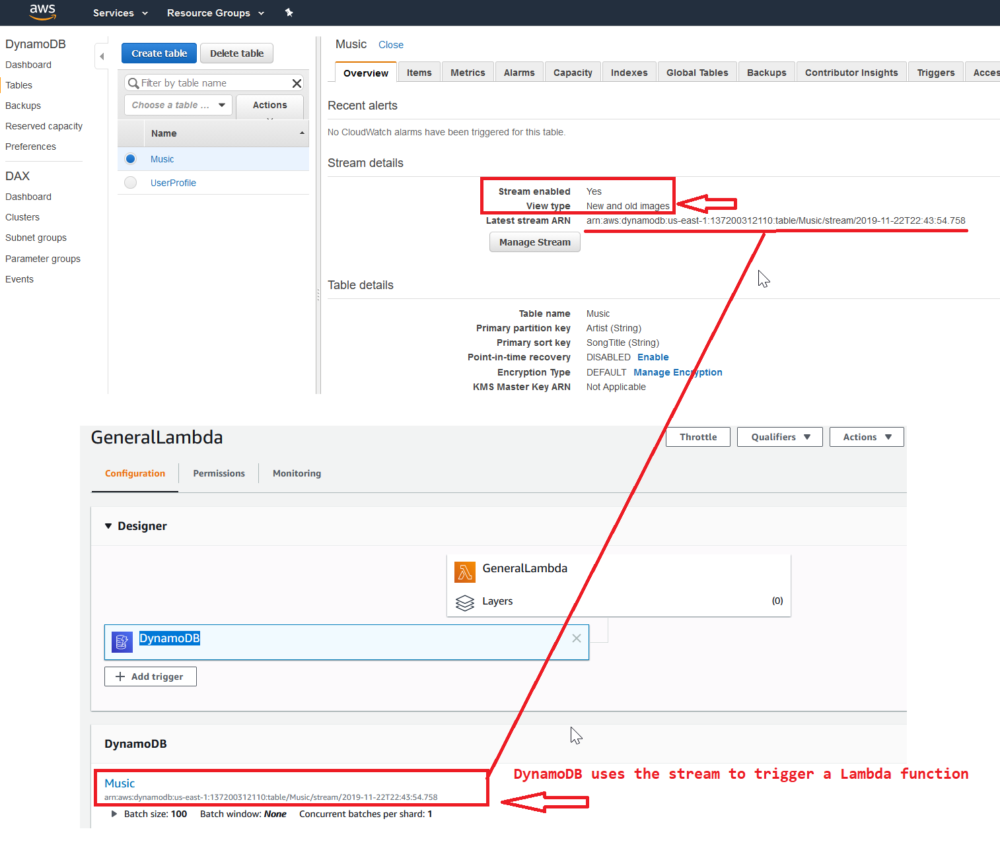

# AWS Learning

## EC2
- After the user has assigned a secondary private IP address to his instance, he needs to configure the operating system on that instance to recognize the secondary private IP address. 
  For AWS Linux, the ec2-net-utils package can take care of this step.
- When a user creates an EBS volume and attaches it as a device, it is required to mount the device.

### EBS
- EBS volumes are created in a specific Availability Zone, and can then be attached to any instances in that same Availability Zone.
- Amazon EBS volumes are designed to be highly available and reliable. 
  At no additional charge to you, Amazon EBS volume data is replicated across multiple servers in an Availability Zone to prevent the loss of data from the failure of any single component. 

## Security
- The IAM users by default cannot change their password. The root owner or IAM administrator needs to set the policy in the password policy page, which should allow the user to change their password.
- The statement is the main element of the IAM policy and it is a must for a policy. 
- The root user can customize login url 
- It is a recommended rule that the root user should grant the least privileges to the IAM user or the group. The higher the privileges, the more problems it can create.
- The only recommended use case for the bucket ACL is to grant write permission to the Amazon S3 Log Delivery group to write access log objects to your bucket.
   Please see [here](https://docs.aws.amazon.com/AmazonS3/latest/dev/access-policy-alternatives-guidelines.html)

### With regard to IAM, when a request is made, the AWS service decides whether a given request should be allowed or denied. 
The evaluation logic follows these rules:
- By default, all requests are denied. (In general, requests made using the account credentials for resources in the account are always allowed.)
- An explicit allow policy overrides this default.
- An explicit deny policy overrides any allows.
## DB

###DynamoDb
- DynamoDb use the stream to trigger a lambda function

## Message
- Queue names are limited to 80 characters. Alphanumeric characters plus hyphens (-) and underscores (_) are allowed. Queue names must be unique within an AWS account
- AWS reserve the right to delete a queue if no activity against the queue for more than 30 consecutive days
- Amazon SQS is engineered to provide "at least once" delivery of all messages in its queues. Although most of the time, each message will be delivered to your application exactly once.
  You should design your system so that processing a message more than once does not create any errors or inconsistencies.
- Amazon SQS makes a best effort to preserve order in messages, but due to the distributed nature of the queue, AWS cannot guarantee that you will receive messages in the exact order you sent them. 
- You typically place sequencing information or timestamps in your messages so that you can reorder them upon receipt.
- A message can be stored in the Simple Queue Service (SQS) from 1 minute up to a maximum of 14 days. Thde fault is 4 days.
- With Amazon SQS version 2008-01-01, the maximum message size for both SOAP and Query requests is 8KB.

## VPC
### Multiple interfaces
If you need to host multiple websites(with different IPs) on a single EC2 instance, the following is the suggested method from AWS:
- Launch a VPC instance with two network interfaces
- Assign elastic IPs from VPC EIP pool to those interfaces (Because, when the user has attached more than one network interface with an instance, AWS cannot assign public IPs to them)
- Assign separate Security Groups if separate Security Groups are needed
This scenario also helps for operating network appliances, such as firewalls or load balancers that have multiple private IP addresses for each network interface.

## SWF
- Amazon SWF consists of a number of different types of programmatic features known as actors. Actors can be workflow starters, deciders, or activity workers.
- These actors communicate with Amazon SWF through its API. You can develop actors in any programming language.

## CloudWatch
- Application can easily create customized metrics in CloudWatch

## Developing
- aws explorer is an Eclipse plugin 

