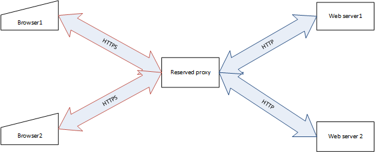

# Security discuss

## Authorize mode
There are two type of authorize mode:

+ direct grant: is usually used in social media. End users manage permissions by themselves to decide who or which application can access their resources 
    + sample : users can grant another users or 3rd party application to access their Gmail or online photos.
+ delegation: is usually used in enterprise application, the application represents the permission for users, users info is in payload.
    + Sample : database access, AWS access
	+ user info in the payload: update contract set updatedBy=**1234** where contractId = 4567

The application  should use delegation mode, then we don’t have token renewal issue because it is not exposed to end user. 

## "as user" function 

"as user" function is designed for QA and DEV environment to simulate another user to test permission.

It is implemented in the application. But it is a bad place to implement in it because every front line application need this function for QA.

It should be implemented in authenticate center or a shared application.

	
## Grant type
It has three types of granting:
+ Authorization code grant: The authorization code grant is the preferred method for authorizing end users. 
    Instead of directly providing user pool tokens to an end user upon authentication, an authorization code is provided. 
	This code is then sent to a custom application that can exchange it for the desired tokens. Because the tokens are never exposed directly to an end user, they are less likely to become compromised.
+ Implicit grant: Only use the implicit grant when there’s a specific reason that the authorization code grant can’t be used.
    In an implicit grant, user pool tokens are exposed directly to the end user.
+ Client credentials grant: The client credentials grant is much more straightforward than the previous two grant types. 
    While the previous grants are intended to obtain tokens for end users, 
	the client credentials grant is typically intended to provide credentials to an application in order to authorize machine-to-machine requests.

## SSL and proxy
In the QA environment, we also need to set SSL on every web server, which is costly.

To avoid setting SSL certificate in each QA web server, we can use reserved proxy to share the SSL certificate:


Sample tomcat web server setting in server.xml: 
```
	<Connector scheme="https"
               secure="true"
               port="8080"
               proxyPort="443"
               proxyName="proxy.server.domain"
	       protocol="HTTP/1.1"
	       connectionTimeout="20000"
	       disableUploadTimeout="true"
               enableLookups="false"               
               />
```	
Sample nginx setting in nginx.conf:
```
    server {
        listen    443;
        location /app1/ {
            proxy_pass http://tomcat.server:8080/app1/;
        }
```
When users directly connect `http://tomcat.server:8080/app1/`, it will be redirected to `https://proxy.server.domain/app1`

## WildCard

Except reserved proxy, we can also use WildCard to reduce troubles and cost for QA environment.

WildCard SSL certificate can support multiple sub-domain: 
    [Wildcard_certificate](https://en.wikipedia.org/wiki/Wildcard_certificate) 
  
Compared with reserved proxy, WildCard setting is simple on server side, and network traffic is low (no hot spot on proxy), but need DNS setting.  

With self signed wildCard domain certificate, Your Java code can't connect the target host by default. You need to change default behaviour like this : 
```java

    public static void skipHttpsValidation() {

        TrustManager[] trustAllCerts = new TrustManager[] {  new TrustAnyCertificate() };  
        try {
            SSLContext sc = SSLContext.getInstance("SSL"); 
            sc.init(null, trustAllCerts, new java.security.SecureRandom()); 
            HttpsURLConnection.setDefaultSSLSocketFactory(sc.getSocketFactory());
            // In this way, we can trust self signed certificate or invalid WildCard certificate            
        } catch (GeneralSecurityException e) {
            throw new UnsupportedOperationException("can't enable TrustManager", e);
        }
        
        HostnameVerifier verifier =  new UntrustedHostVerifier() ;
        HttpsURLConnection.setDefaultHostnameVerifier(verifier);
    }

    static class TrustAnyCertificate implements X509TrustManager{

        @Override
        public void checkClientTrusted(X509Certificate[] certs, String authType) {} 

        @Override
        public void checkServerTrusted(X509Certificate[] arg0, String arg1) throws CertificateException {}

        @Override
        public X509Certificate[] getAcceptedIssuers() {
            return new X509Certificate[0];
        }
    }    

    static class UntrustedHostVerifier implements HostnameVerifier{
        List<String> hostList; 
        
        public UntrustedHostVerifier(){            
            hostList  = MyConfig.loadTrustedHostList();;
        }

        @Override
        public boolean verify(String hostname, SSLSession sslSession) {             
            if (hostList.contains(hostname)) {
                // because SSL certificate didn't match the domain name,
                // so we have to manually skip SSL certificate verification
                log.debug("skip SSL certificate verification on " + hostname);
                return true;
            }
            return false;
        }
    }

```

